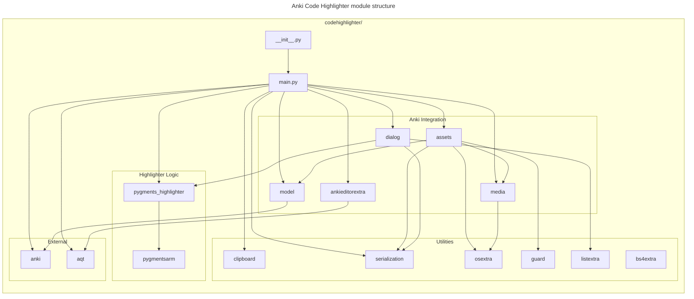

# 🛠️ Developer documentation

This is a documentation file for Code Highlighter’s developers.

## Dev environment setup

This section describes how to setup your development environment.

This project requires the following tools:

- [Black]
- [Commitlint]
- [Lefthook]
- [Just]
- [Markdownlint]
- [Pyenv]
- [Ruff]
- [Uv]

1. Install the required Python version:

   ```shell
   pyenv install
   ```

1. Set up a local virtual environment:

   ```shell
   uv venv
   ```

1. Install development dependencies:

   ```shell
   uv pip install --group dev
   ```

1. Install Lefthook:

   ```shell
   lefthook install
   ```

## Repository structure

Branches:

- `v1` contains the original major version of ACH with Highlight.js and
  class-based Pygments.
  It is no longer actively maintained.
- `migrate-hljs` builds on top of `v1` and contains a prototype for migrating
  cards to `v2` (away from Highlight.js, maybe more).
  It will be merged into `v1` once done.

## Updating Regular Dependencies

Run `uv sync --upgrade` to update dependencies in the lockfile.

## Updating Pygments

Anki Code Highlighter comes in bundled with the [Pygments] library, and its
version is tracked as a
[Git submodule](https://git-scm.com/book/en/v2/Git-Tools-Submodules) inside this
repository.

To update Pygments, go to the submodule and pull the desired version.
For example:

```shell
cd pydeps/pygments
git fetch
git checkout 2.18.0
```

## Updating Python

This package sets up a specific Python version to keep the dev environment in
sync with what Anki uses.
To update this Python version, you need to:

1. If in a virtual environment, deactivate it and remove it (`rm -r .venv`).
2. Update the Python spec in `.python-version`, `mypy.ini`, and
   `pyproject.toml`.
3. Delete the Mypy cache:
   `rm -r .mypy_cache`.
4. Install the new Python version with `pyenv install`.
5. Install the new virtual environment with `uv venv --python 3.X.Y`.
6. Install dependencies in the virtual environment:
   `uv sync --locked`.

### Generating Pygment stylesheets

In `assets/_gch-pygment-solarized.css` I keep the stylesheet for code formatted
with Pygments plus a few lines for general styles.
I generated the style there with `just generate-pygments-css`.

## Testing

1. Run unit tests and mypy with `just test`.
2. Test supported Anki versions (2.1.49 and latest) by packaging the plugin and
   importing the plugin into the lowest and the newest support Anki.

## Release & distribution

1. Bump the version and release the commit & tag:
   `just bump`.
1. Create `codehighlighter.ankiaddon` and a GitHub release:
   `just release`.
1. [Share the package on Anki](https://addon-docs.ankiweb.net/#/sharing) using
   the [asset dashboard](https://ankiweb.net/shared/mine).

## Architecture



### Module Breakdown

- **Entry point**:
  `__init__.py` and `main.py` initialize the add-on and register hooks with
  Anki.
- **Anki Integration**:
  Modules that interact directly with Anki's editor, models, media, and assets.
- **Highlighter Logic**:
  Pure logic for highlighting code using Pygments, including custom lexers.
- **Utilities**:
  General-purpose helpers for HTML manipulation, serialization, and OS
  operations.

## Design decisions

This section discuss some design decisions made for this plugin.

### Highlighter concept

One fundamental abstraction is that of **highlighter**.
A highlighter is essentially a function that produces an HTML representing a
highlighted code snippet given the following:

- A string with the unmarked code snippet.
- A language that code snippet represents.
- Additional styling options.

For code clarity and modularity, I keep such pure highlighters in separate
modules (`pygments`).
A highlighter does not implement any logic related to Anki including sanitising
input from HTML markup.

### Using `assets/_gch*` files for CSS and JS

The asset files start with an underscore, because then Anki ignores them
([source][anki-media-ignore]).

This plugin saves its assets directly in the global `assets` directory.

- The only way to share files across desktop and mobile seems to be through
  `collection.media`.
- Anki does not support file directories in `collection.media`.

#### Alternatives considered

##### Fetching CSS and JS assets from Internet

Loading files from Internet has the disadvantage of making my Anki solving
experience depend on Internet, which I don't think is reasonable on mobile.

### Card template instrumentation mode

The plugin instruments all card templates by default, because that’s what most
people will want.
It requires zero-effort from a user to get to what they want, which is being
able to highlight code.
It’s non-intrusive, the added styles should not interfere with users’
preexisting settings as they are namespaced by a class (`pygments`).

### No inline styles

The add-on uses classes, not inline styles, to support day and night modes.

### Dropping Highlight.js

I decided to drop Highlight.js, because it caused significant problems:

- Running the scripts causes flickering (flash of unstyled content) on mobile.
- It requires CSS and JS files to be imported.
  Modifying templates is frowned upon by users.
  It also makes code more complicated.
- You can’t create clozes with it.
- It makes the add-on more complicated to use as you have an additional dialog
  to go through.

The only benefit of Highlight.js is that it doesn’t spoil a card’s HTML with
tags.
This is not much of a benefit in practice.
I’ve never relied on it much.

### No async/await

We don’t use Python coroutines, because
`aqt.editor.EditorWebView.evalWithCallback` is not compatible with them.

[Black]: https://black.readthedocs.io/en/stable/
[Commitlint]: https://github.com/conventional-changelog/commitlint
[Lefthook]: https://github.com/evilmartians/lefthook
[Just]: https://github.com/casey/just
[Markdownlint]: https://github.com/igorshubovych/markdownlint-cli
[Pyenv]: https://github.com/pyenv/pyenv
[Pygments]: https://github.com/pygments/pygments
[Ruff]: https://github.com/astral-sh/ruff
[Uv]: https://docs.astral.sh/uv/
[anki-media-ignore]: https://anki.tenderapp.com/discussions/ankidesktop/39510-anki-is-completely-ignoring-media-files-starting-with-underscores-when-cleaning-up
