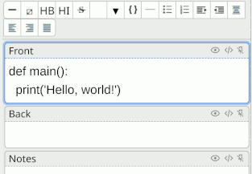

# Anki Code Highlighter

An Anki plugin that adds syntax highlighting to code snippets.

<!-- markdownlint-disable-next-line -->
<p align="center"></p>

## Features

* Uses a color scheme that works in day and night modes.
* Works on Anki for desktop and AnkiDroid.

## Installation

### Fetching from AnkiWeb

The recommended way to install this plugin is directly from
[AnkiWeb](https://ankiweb.net/shared/info/112228974) using Anki's add-on
management.

### Fetching from source

Alternatively, you can install this plugin from source.

1. Run `package`.
2. Import `codehighlighter.ankiaddon` in Anki.

## Usage

1. Write a code snippet in a card editor.
2. Select your code snippet.
3. Press `CTRL+'`.

For the list of supported languages and their corresponding codes, see
`assets/_ch-hljs-lang-*.min.js` files in this repository.

## Refresh & Removal

This plugin installs its own JS and CSS files as well as modifies card
templates. You need to run some manual steps if you:

- add a new template
- want to delete the plugin

If you add a new card template, run `Extras/Tools > Refresh Code Highlighter
Assets`.

To remove the plugin, run `Extras/Tools > Delete Code Highlighter Assets`
before deleting the plugin using Anki's internal add-on system. This manual
step is necessary until Anki adds [add-on lifecycle
hooks](https://forums.ankiweb.net/t/install-update-delete-addon-hook-points/18532).

## For Developers

### Dev Environment Setup

1. Install the required Python version:

   ```shell
   pyenv install CHECK_PIPFILE
   ```

1. Set up Pipenv:

    ```shell
    pipenv install --dev
    ```

1. Set up npm:

    ```shell
    npm install
    ```

1. Install Lefthook:

    ```shell
    lefthook install
    ```

### Updating highlight.js

`_assets/_cs-highlight.js` contains the single-file implementation of
[highlight.js][hljs]. It comes from the ZIP package available on [their main
site][hljs].

### Generating Pygment stylesheets

In `assets/_ch-pygment-solarized.css` I keep the stylesheet for code formatted
with pygments plus a few lines for general styles. I generated the style there with
`dev/bin/pygutils.py` with some minor adjustments by hand:

1. There are some tech debt lines relevant for all `<pre><code>` tags.
2. I have added some custom styles for borders.

### Testing

1. Run unit tests and mypy with `testall`.
2. Test supported Anki versions (2.1.49 and latest) by packaging the plugin and
   importing the plugin into the lowest and the newest support Anki.

### Release & distribution

1. Create a release commit.
    1. Bump up the package version in `codehighlighter/manifest.json`.
    2. Tag the release commit `git tag vx.y.z && git push origin vx.y.z`.
2. Use the `dev/bin/package` tool to create `codehighlighter.ankiaddon`.
3. [Share the package on Anki.](https://addon-docs.ankiweb.net/#/sharing)

### Design Decisions

This section discuss some design decisions made for this plugin.

### Using `assets/_ch*` files for CSS and JS

The asset files start with an underscore, because then Anki ignores them
([source](https://anki.tenderapp.com/discussions/ankidesktop/39510-anki-is-completely-ignoring-media-files-starting-with-underscores-when-cleaning-up)).

This plugin saves its assets directly in the global `assets` directory.

* The only way to share files seems to be through `collection.media`.
* Anki does not support file directories in `collection.media`.

#### Alternatives considered

##### Fetching CSS and JS assets from Internet

Loading files from Internet has the disadvantage of making my Anki solving
experience depend on Internet.

[hljs]: https://highlightjs.org/
