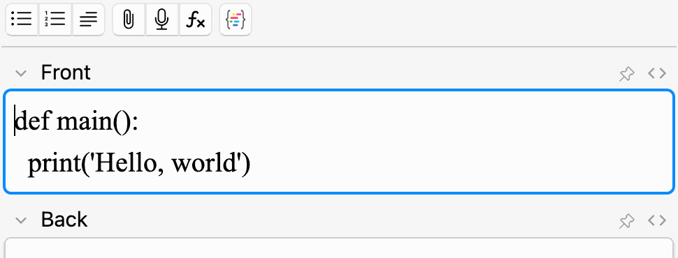

# 🌈 Anki Code Highlighter

An Anki plugin that adds syntax highlighting to code snippets.

<!-- markdownlint-disable-next-line -->

## Features

- A color scheme that works in day and night modes.
- Works on Anki for desktop and AnkiDroid.
- WYSIWYG highlighting.
- Block and inline highlighting

## Installation

### Fetching from AnkiWeb

The recommended way to install this plugin is directly from
[AnkiWeb](https://ankiweb.net/shared/info/1527277801) using Anki’s add-on
management.

### Fetching from source

Alternatively, you can install this plugin from source.

1. Run `dev/bin/package`.
2. Import `codehighlighter.ankiaddon` in Anki.

## Usage

You can either highlight code from your clipboard or highlight a snippet of code
already present in a card field.

### Highlighting from clipboard

1. Put the cursor in the place you want to place your code.
2. Press `⌃+o` (on macOS, `⌘+o`) or click this add-on’s button in the
   editor’s button bar.

### Highlighting an already written code snippet

1. Write a code snippet in a card editor.
2. Select the code snippet.
3. Press `⌃+o` (on macOS, `⌘+o`) or click this add-on’s button in the
   editor’s button bar.

The plugin works on untagged code blocks.
Do not add your own HTML tags like `<code>` or `<pre><code>` to the snippet you
want to highlight.
If you have run into issues with preannotated code snippets, see
[this comment][0] for how to fix this.

### Supported highlighters

This add-on uses [Pygments](https://pygments.org/).
It creates highlighting tags when you run this plugin.
This is useful for creating cloze cards.
It supports both inline code and code blocks.

### Configuration

The plugin accepts the following configuration options:

- `block-style` (default:
  "display:flex; justify-content:center;") — The CSS style applied to the outer
  most container of a block code snippet.
  The default centers the block.
- `auto-detect-display-style` (default:
  `true`) — Whether the add-on should auto-detect if the code snippet should be
  formatted as a block or inline.
- `shortcut` (e.g. `ctrl+o`) — this sets the shortcut that triggers this plugin.
- `dev-mode` (default:
  `false`) — Enables developer mode, which exposes the assets management options
  (Refresh/Delete assets) under the Tools menu.

### Known limitations

#### Can’t highlight split HTML nodes

If you see “The selection splits an HTML node, which prevents the highlighting
plugin from proceeding,” you are partially selecting an HTML element.

This plugin can not highlight a selection that partially selects an HTML
element.
To work around this, [see these instructions][1].

## 🗑️ Uninstalling

This add-on installs its own CSS files into Anki’s media folder.
You need to run some manual steps if you want to fully delete the add-on.

> [!WARNING]
> Removing the CSS stylesheet file will remove highlighting from all notes
> that use that stylesheet.
> If you want to delete the add-on but keep already highlighted cards, then
> skip the file removal steps (1, 2, and 3).

1. Open the add-on’s config, and add or set `"dev-mode"` to `true`.
2. Restart Anki.
3. Run `Extras/Tools > Delete Greg’s Code Highlighter Assets`.
4. [Delete the add-on.][add-on-client-guide]

This manual step is necessary until Anki adds [add-on lifecycle hooks][2].

[0]: https://github.com/gregorias/anki-code-highlighter/issues/29#issuecomment-1367298126
[1]: https://github.com/gregorias/anki-code-highlighter/issues/72#issuecomment-1830404297
[2]: https://forums.ankiweb.net/t/install-update-delete-addon-hook-points/18532
[add-on-client-guide]: https://docs.ankiweb.net/addons.html
